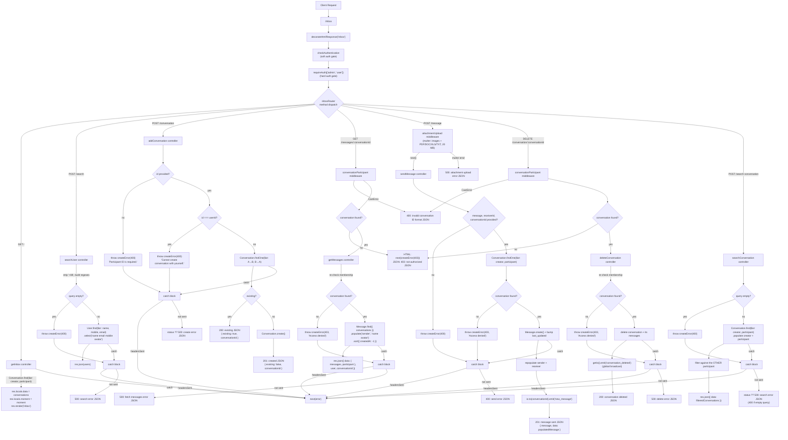

# Inbox Router Flow Diagram

```mermaid
flowchart TD
    %% Entry point
    Client["Client Request"] --> Route["/inbox"]

    %% Shared middleware chain (runs for all methods on /inbox)
    Route --> Decorate["decorateHtmlResponse('Inbox')"]
    Decorate --> CheckAuth["checkAuthentication<br/>(soft auth gate)"]
    CheckAuth --> RequireAuth["requireAuth(['admin', 'user'])<br/>(hard auth gate)"]

    %% Router dispatch by method
    RequireAuth --> Router{"inboxRouter<br/>method dispatch"}

    %% GET /
    Router -- "GET /" --> GetInbox["getInbox controller"]
    GetInbox -- "Conversation.find($or: creator, participant)" --> RenderInbox["res.locals.data = conversations<br/>res.locals.moment = moment<br/>res.render('inbox')"]
    GetInbox -- "catch" --> NextErr["next(error)"]

    %% POST /search
    Router -- "POST /search" --> SearchUser["searchUser controller"]
    SearchUser -- "strip '+88', build regexes" --> EmptySearch{"query empty?"}
    EmptySearch -- "yes" --> Throw400Search["throw createError(400)"]
    EmptySearch -- "no" --> UserFind["User.find($or: name, mobile, email)<br/>.select('name email mobile avatar')"]
    UserFind --> JsonUsers["res.json(users)"]
    Throw400Search --> CatchSearch["catch block"]
    UserFind -- "catch" --> CatchSearch
    CatchSearch -- "headersSent" --> NextErr
    CatchSearch -- "not sent" --> Err500Search["500: search error JSON"]

    %% POST /conversation
    Router -- "POST /conversation" --> AddConv["addConversation controller"]
    AddConv --> HasId{"id provided?"}
    HasId -- "no" --> Throw400Id["throw createError(400)<br/>'Participant ID is required.'"]
    HasId -- "yes" --> SelfCheck{"id === userId?"}
    SelfCheck -- "yes" --> Throw400Self["throw createError(400)<br/>'Cannot create conversation with yourself.'"]
    SelfCheck -- "no" --> FindExisting["Conversation.findOne($or: A→B, B→A)"]
    FindExisting --> Exists{"existing?"}
    Exists -- "yes" --> Json200["200: existing JSON<br/>{ existing: true, conversationId }"]
    Exists -- "no" --> CreateConv["Conversation.create()"]
    CreateConv --> Json201["201: created JSON<br/>{ existing: false, conversationId }"]
    Throw400Id --> CatchAdd["catch block"]
    Throw400Self --> CatchAdd
    FindExisting -- "catch" --> CatchAdd
    CatchAdd -- "headersSent" --> NextErr
    CatchAdd -- "not sent" --> ErrStatusAdd["status ?? 500: create error JSON"]

    %% GET /messages/:conversationId
    Router -- "GET /messages/:conversationId" --> ConvAuth["conversationParticipant middleware"]
    ConvAuth -- "CastError" --> CastErr["400: invalid conversation ID format JSON"]
    ConvAuth --> ConvFound{"conversation found?"}
    ConvFound -- "no" --> Conv403["HTML: next(createError(403))<br/>JSON: 403: not authorized JSON"]
    ConvFound -- "yes" --> GetMessages["getMessages controller"]
    GetMessages -- "re-check membership" --> MsgFound{"conversation found?"}
    MsgFound -- "no" --> Throw403Msg["throw createError(403, 'Access denied')"]
    MsgFound -- "yes" --> MsgFind["Message.find({ conversations })<br/>.populate('sender', 'name avatar')<br/>.sort({ createdAt: -1 })"]
    MsgFind --> JsonMsgs["res.json({ data: { messages, participant },<br/>user, conversationId })"]
    Throw403Msg --> CatchMsgs["catch block"]
    MsgFind -- "catch" --> CatchMsgs
    CatchMsgs -- "headersSent" --> NextErr
    CatchMsgs -- "not sent" --> Err500Msgs["500: fetch messages error JSON"]

    %% POST /message
    Router -- "POST /message" --> AttachUpload["attachmentUpload middleware<br/>(multer: images + PDF/DOC/XLS/TXT, 20 MB)"]
    AttachUpload -- "next()" --> SendMsg["sendMessage controller"]
    AttachUpload -- "multer error" --> AttachErr["500: attachment upload error JSON"]
    SendMsg --> ValidateMsg{"message, receiverId, conversationId provided?"}
    ValidateMsg -- "no" --> Throw400Msg["throw createError(400)"]
    ValidateMsg -- "yes" --> InlineAuth["Conversation.findOne($or: creator, participant)"]
    InlineAuth --> ConvOk{"conversation found?"}
    ConvOk -- "no" --> Throw403Send["throw createError(403, 'Access denied')"]
    ConvOk -- "yes" --> CreateMsg["Message.create() + bump last_updated"]
    CreateMsg --> Repopulate["repopulate sender + receiver"]
    Repopulate --> EmitSocket["io.to(conversationId).emit('new_message')"]
    EmitSocket --> Json201Send["201: message sent JSON<br/>{ message, data: populatedMessage }"]
    Throw400Msg --> CatchSend["catch block"]
    Throw403Send --> CatchSend
    CreateMsg -- "catch" --> CatchSend
    CatchSend -- "headersSent" --> NextErr
    CatchSend -- "not sent" --> Err400Send["400: send error JSON"]

    %% DELETE /conversation/:conversationId
    Router -- "DELETE /conversation/:conversationId" --> ConvAuth2["conversationParticipant middleware"]
    ConvAuth2 -- "CastError" --> CastErr
    ConvAuth2 --> ConvFound2{"conversation found?"}
    ConvFound2 -- "no" --> Conv403
    ConvFound2 -- "yes" --> DeleteConv["deleteConversation controller"]
    DeleteConv -- "re-check membership" --> DelFound{"conversation found?"}
    DelFound -- "no" --> Throw403Del["throw createError(403, 'Access denied')"]
    DelFound -- "yes" --> DeleteOps["delete conversation + its messages"]
    DeleteOps --> Broadcast["getIo().emit('conversation_deleted')<br/>(global broadcast)"]
    Broadcast --> Json200Del["200: conversation deleted JSON"]
    Throw403Del --> CatchDel["catch block"]
    DeleteOps -- "catch" --> CatchDel
    CatchDel -- "headersSent" --> NextErr
    CatchDel -- "not sent" --> Err500Del["500: delete error JSON"]

    %% POST /search-conversation
    Router -- "POST /search-conversation" --> SearchConv["searchConversation controller"]
    SearchConv --> EmptyConv{"query empty?"}
    EmptyConv -- "yes" --> Throw400Conv["throw createError(400)"]
    EmptyConv -- "no" --> FindConvs["Conversation.find($or: creator, participant)<br/>.populate creator + participant"]
    FindConvs --> FilterOther["filter against the OTHER participant"]
    FilterOther --> JsonFiltered["res.json({ data: filteredConversations })"]
    Throw400Conv --> CatchConv["catch block"]
    FindConvs -- "catch" --> CatchConv
    CatchConv -- "headersSent" --> NextErr
    CatchConv -- "not sent" --> ErrStatusConv["status ?? 500: search error JSON<br/>(400 if empty query)"]
```
