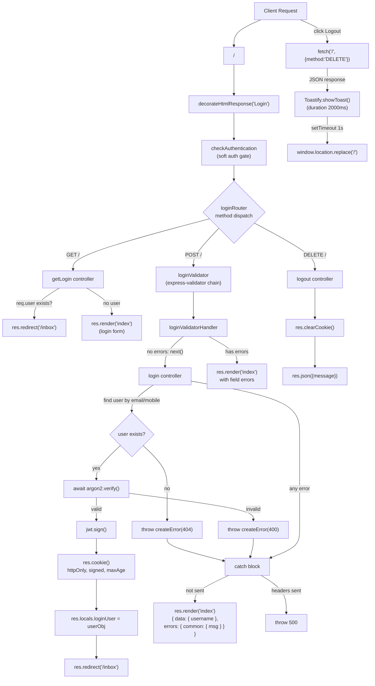

# Login Router Flow Diagram

```mermaid
flowchart TD
    %% Entry point
    Client["Client Request"] --> Route["/"]

    %% Shared middleware chain (runs for all methods on /)
    Route --> Decorate["decorateHtmlResponse('Login')"]
    Decorate --> CheckAuth["checkAuthentication<br/>(soft auth gate)"]

    %% Router dispatch by method
    CheckAuth --> Router{"loginRouter<br/>method dispatch"}

    %% GET /
    Router -- "GET /" --> GetLogin["getLogin controller"]
    GetLogin -- "req.user exists?" --> RedirectInbox["res.redirect('/inbox')"]
    GetLogin -- "no user" --> RenderLogin["res.render('index')<br/>(login form)"]

    %% POST /
    Router -- "POST /" --> LoginValidator["loginValidator<br/>(express-validator chain)"]
    LoginValidator --> ValidatorHandler["loginValidatorHandler"]
    ValidatorHandler -- "no errors: next()" --> LoginCtrl["login controller"]
    ValidatorHandler -- "has errors" --> RenderLoginErr["res.render('index')<br/>with field errors"]

    LoginCtrl -- "find user by email/mobile" --> UserFound{"user exists?"}
    UserFound -- "no" --> Throw404["throw createError(404)"]
    UserFound -- "yes" --> VerifyPwd["await argon2.verify()"]
    VerifyPwd -- "invalid" --> Throw400["throw createError(400)"]
    VerifyPwd -- "valid" --> SignJWT["jwt.sign()"]
    SignJWT --> SetCookie["res.cookie()<br/>httpOnly, signed, maxAge"]
    SetCookie --> SetLocals["res.locals.loginUser = userObj"]
    SetLocals --> RenderInbox["res.redirect('/inbox')"]

    %% Error handling in login controller
    Throw404 --> CatchBlock["catch block"]
    Throw400 --> CatchBlock
    LoginCtrl -- "any error" --> CatchBlock
    CatchBlock -- "not sent" --> RenderLoginErr2["res.render('index')<br/>{ data: { username },<br/>errors: { common: { msg } } }"]
    CatchBlock -- "headers sent" --> Throw500["throw 500"]

    %% DELETE /
    Router -- "DELETE /" --> LogoutCtrl["logout controller"]
    LogoutCtrl --> ClearCookie["res.clearCookie()"]
    ClearCookie --> JsonResponse["res.json({message})"]

    %% Client-side logout flow
    Client -- "click Logout" --> FetchDelete["fetch('/', {method:'DELETE'})"]
    FetchDelete -- "JSON response" --> ShowToast["Toastify.showToast()<br/>(duration 2000ms)"]
    ShowToast -- "setTimeout 1s" --> RedirectHome["window.location.replace('/')"]
```