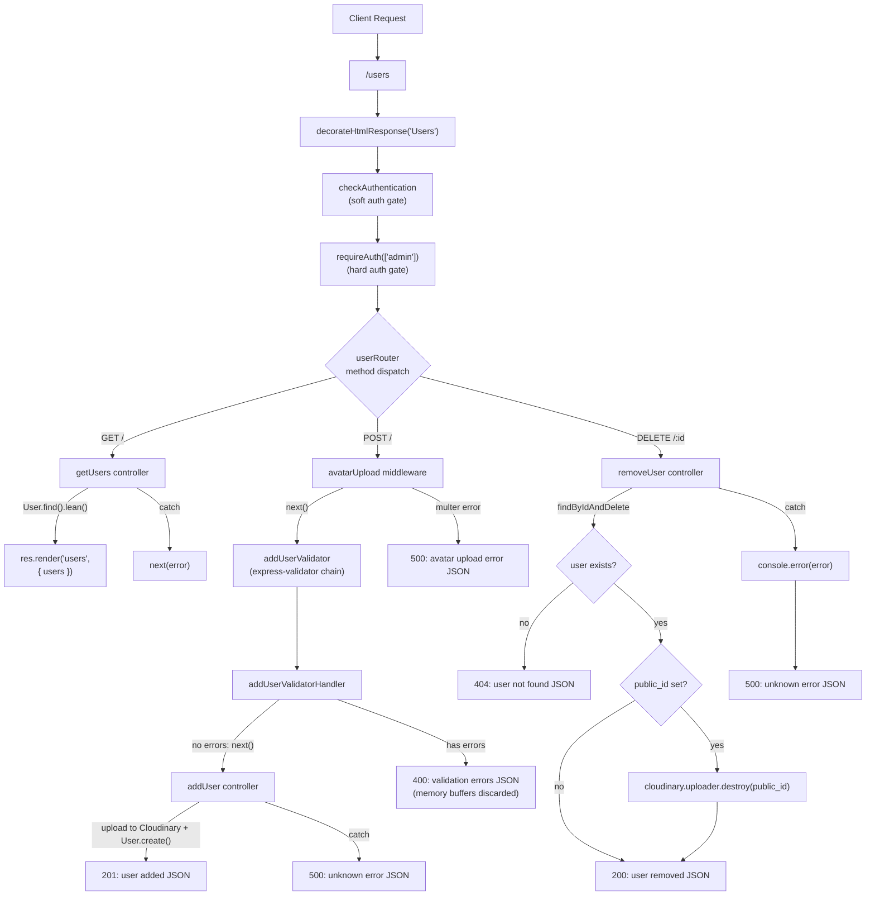

# Users Router Flow Diagram

```mermaid
flowchart TD
    %% Entry point
    Client["Client Request"] --> Route["/users"]

    %% Shared middleware chain (runs for all methods on /users)
    Route --> Decorate["decorateHtmlResponse('Users')"]
    Decorate --> CheckAuth["checkAuthentication<br/>(soft auth gate)"]
    CheckAuth --> RequireAuth["requireAuth(['admin'])<br/>(hard auth gate)"]

    %% Router dispatch by method
    RequireAuth --> Router{"userRouter<br/>method dispatch"}

    %% GET /users
    Router -- "GET /" --> GetUsers["getUsers controller"]
    GetUsers -- "User.find().lean()" --> RenderUsers["res.render('users',<br/>{ users })"]
    GetUsers -- "catch" --> NextErr["next(error)"]

    %% POST /users
    Router -- "POST /" --> AvatarUpload["avatarUpload middleware"]
    AvatarUpload -- "next()" --> AddUserValidator["addUserValidator<br/>(express-validator chain)"]
    AvatarUpload -- "multer error" --> AvatarErr["500: avatar upload error JSON"]

    AddUserValidator --> ValidatorHandler["addUserValidatorHandler"]

    ValidatorHandler -- "no errors: next()" --> AddUser["addUser controller"]
    ValidatorHandler -- "has errors" --> ValErr["400: validation errors JSON<br/>(memory buffers discarded)"]

    AddUser -- "upload to Cloudinary + User.create()" --> Success201["201: user added JSON"]
    AddUser -- "catch" --> Err500["500: unknown error JSON"]

    %% DELETE /users/:id
    Router -- "DELETE /:id" --> RemoveUser["removeUser controller"]
    RemoveUser -- "findByIdAndDelete" --> UserFound{"user exists?"}
    UserFound -- "no" --> Err404["404: user not found JSON"]
    UserFound -- "yes" --> AvatarExists{"public_id set?"}
    AvatarExists -- "yes" --> DestroyAvatar["cloudinary.uploader.destroy(public_id)"]
    AvatarExists -- "no" --> Success200["200: user removed JSON"]
    DestroyAvatar --> Success200
    RemoveUser -- "catch" --> LogError["console.error(error)"]
    LogError --> Err500Del["500: unknown error JSON"]
```